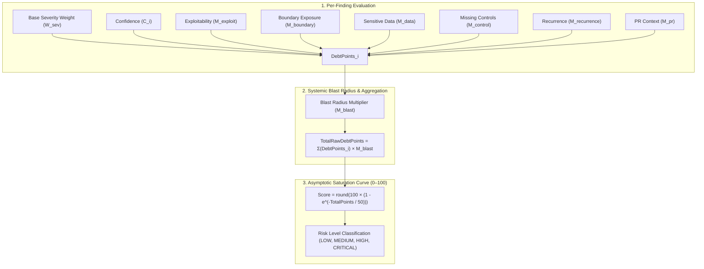

# AIShield Debt — Security Debt Scoring Formula & Methodology

## 1. Operating Principles & Philosophy

### Why Simple Vulnerability Counting Fails
Traditional security tools present developers with flat lists of issues (e.g., "47 open findings"). This creates alert fatigue and fails to represent true technical risk:
- Five informational linter warnings should not outweigh one hardcoded AWS root secret.
- An Insecure Direct Object Reference (IDOR) on an unauthenticated, public payment endpoint carries vastly higher business debt than a path traversal warning in an internal test fixture.
- Two identical alerts reported by different linters should not artificially double a team's measured security debt.

### Core Architecture Invariant: The 0–100 Scale & "Zero is Not Perfect"
> **Important Principle**: A Security Debt score of **0 indicates zero detected security debt** based on current scanner configurations, rules, and AI contextual analysis.
> 
> **0 does NOT represent "perfect security" or invulnerability.** 
> The score represents *accumulated, estimated technical and security debt*, not a theoretical guarantee against zero-day exploits.

---

## 2. Mathematical Scoring Model

### Step 1: Base Finding Weight ($W_{\text{sev}}$)
Every finding begins with a deterministic base point allocation according to its canonical normalized severity:

| Severity | Base Points ($W_{\text{sev}}$) | Description |
| :--- | :--- | :--- |
| **`CRITICAL`** | `25.0` | Remote code execution, SQLi, active hardcoded cloud root keys |
| **`HIGH`** | `12.0` | IDOR, missing authorization, privilege escalation, high-severity CVEs |
| **`MEDIUM`** | `5.0` | Insecure CORS, weak password hash, medium CVEs, SSRF in internal network |
| **`LOW`** | `1.5` | Deprecated cryptographic cipher, minor configuration smell, missing rate-limit header |
| **`INFO`** | `0.3` | Informational diagnostics, debug flags left in non-production files |

---

### Step 2: Context Multipliers

An individual finding's raw debt points are computed as:

$$\text{DebtPoints}_i = W_{\text{sev}} \times C_i \times M_{\text{exploit}} \times M_{\text{boundary}} \times M_{\text{data}} \times M_{\text{control}} \times M_{\text{recurrence}} \times M_{\text{pr}}$$

#### 1. Confidence Factor ($C_i \in [0.1, 1.0]$)
- Scaled linearly with finding confidence:
  - Deterministic CVEs & Lockfiles: $C_i = 1.0$
  - Verified Secrets & AST Signatures: $C_i = 0.90 - 0.95$
  - AI Contextual Findings: $C_i = 0.70 - 0.90$
  - Corroborated Findings (Scanner + AI): $C_{\text{combined}} = 1 - (1 - C_{\text{scanner}}) \times (1 - C_{\text{ai}})$

#### 2. Exploitability Multiplier ($M_{\text{exploit}}$)
- **$1.4\times$**: Known active exploit in the wild (CISA KEV, public PoC, CVSS Exploitability $\ge 2.8$).
- **$1.2\times$**: Network-accessible, unauthenticated remote vector.
- **$1.0\times$**: Standard authenticated vector.
- **$0.9\times$**: Local access required or complex prerequisites.

#### 3. Security Boundary Multiplier ($M_{\text{boundary}}$)
Derived from file path and route context:
- **$1.3\times$**: Ingress / Public API (`routes/`, `controllers/`, `handlers/`, `api/`, `gateway/`, `auth/`).
- **$1.1\times$**: Core domain models and databases (`models/`, `db/`, `services/`, `entities/`).
- **$0.95\times$**: Background workers and internal scripts (`workers/`, `jobs/`, `tasks/`).
- **$0.40\times$**: Test and fixture files (`tests/`, `__tests__/`, `mock/`, `fixtures/`).
- **$1.0\times$**: Default general source files.

#### 4. Sensitive Data Exposure Multiplier ($M_{\text{data}}$)
- **$1.35\times$**: Direct infrastructure credentials, private keys, or API tokens (`category: 'secrets'`).
- **$1.25\times$**: PII, financial details, user password hashes (`category: 'data_exposure'`).
- **$1.0\times$**: No sensitive data directly exposed.

#### 5. Missing Security Controls Multiplier ($M_{\text{control}}$)
- **$1.25\times$**: Primary security control completely absent (`category: 'authorization'` or `'authentication'`).
- **$1.15\times$**: Protective headers or policies absent (`category: 'configuration'`).
- **$1.0\times$**: Standard logic or dependency flaw where controls exist.

#### 6. Recurrence Multiplier ($M_{\text{recurrence}}$)
Persistent debt compounds over time:
- **$1.0\times$**: First time detected (newly introduced).
- **$1.15\times$**: Detected across 2 to 4 consecutive scans.
- **$1.30\times$**: Lingering debt detected $\ge 5$ times (>30 days unaddressed).

#### 7. Pull Request Urgency Multiplier ($M_{\text{pr}}$)
- **$1.20\times$**: Finding introduced in the active PR diff (actionable at review time).
- **$1.0\times$**: Pre-existing repository debt.

---

### Step 3: Blast Radius Multiplier ($M_{\text{blast}}$)
Systemic vulnerabilities spanning multiple files represent wider organizational debt:

$$M_{\text{blast}} = 1 + 0.05 \times \min(\text{FileCount} - 1, 10)$$

*(e.g., vulnerabilities across 5 distinct files add a $+20\%$ systemic multiplier).*

$$\text{TotalRawDebtPoints} = \left(\sum_{i=1}^{N} \text{DebtPoints}_i\right) \times M_{\text{blast}}$$

---

### Step 4: Asymptotic Saturation Mapping to [0, 100]

Rather than arbitrarily truncating at 100 with a `Math.min(100, x)`, AIShield Debt uses an asymptotic saturation model with scale parameter $K = 50.0$:

$$\text{Score} = \text{round}\left(100 \times \left(1 - e^{-\frac{\text{TotalRawDebtPoints}}{K}}\right)\right)$$

#### Saturation Curve Benchmark Table:
| Total Raw Points | Score (0–100) | Risk Level | Interpretation |
| :---: | :---: | :---: | :--- |
| **0.0** | **0** | **LOW** | Clean scan; no detected security debt. |
| **1.5** | **3** | **LOW** | Minor linter or deprecation warnings. |
| **5.0** | **10** | **LOW** | Single medium finding. |
| **12.0** | **21** | **MEDIUM** | Single high-severity finding in an internal module. |
| **25.0** | **39** | **MEDIUM** | Single critical vulnerability (or two high findings). |
| **50.0** | **63** | **HIGH** | Multiple critical findings or extensive high-risk control gaps. |
| **100.0** | **86** | **CRITICAL** | Severe security debt across core endpoints. |
| **$\ge 150.0$** | **$\ge 95$** | **CRITICAL** | Extreme systemic risk; immediate remediation required. |

---

## 3. Clearly Defined Risk Level Thresholds

| Score Range | Risk Level | Meaning & Action |
| :---: | :---: | :--- |
| **0 – 15** | `LOW` | **Minimal Debt**: Codebase is clean or contains cosmetic debt. Normal development. |
| **16 – 40** | `MEDIUM` | **Moderate Debt**: Known moderate vulnerabilities present. Schedule for current sprint. |
| **41 – 70** | `HIGH` | **Elevated Debt**: Critical/high vulnerabilities in public or core paths. Prioritize review. |
| **71 – 100** | `CRITICAL` | **Critical Debt**: Severe unmitigated vulnerabilities or exposed credentials. Block merge. |

---

## 4. Pull Request Delta Analysis

When analyzing a Pull Request, the engine computes:

1. **`previousScore`**: Baseline security debt score before the PR was opened (target branch).
2. **`score`**: Current security debt score including the PR changes.
3. **`delta`**: Net change in debt:
   $$\text{delta} = \text{score} - \text{previousScore}$$
   - **$\text{delta} > 0$**: The PR **introduced new debt** (regressed security posture).
   - **$\text{delta} < 0$**: The PR **reduced existing debt** (net improvement!).
   - **$\text{delta} = 0$**: Security posture is unchanged.
4. **`newDebt`**: Debt points contributed solely by findings introduced in files edited by the PR.
5. **`resolvedDebt`**: Debt points eliminated because historical findings were fixed in this PR.

---

## 5. Objective Treatment of AI Findings

AIShield Debt enforces that **a finding's score never depends solely on whether an LLM generated it**:
- Both deterministic scanner findings and AI contextual findings pass through the exact same mathematical formula.
- AI findings provide structured `confidence` and `evidence`.
- A high-confidence AI finding identifying an authorization gap (e.g. IDOR on line 42 with clear evidence) is evaluated by its severity, boundary, and control status—not arbitrarily discounted because it came from an AI analyzer.
- When an AI finding corroborates a deterministic scanner finding, the engine uses **probabilistic union** to increase confidence:
  $$C_{\text{combined}} = 1 - (1 - C_{\text{scanner}}) \times (1 - C_{\text{ai}})$$
  which appropriately reflects higher certainty in the resulting debt score.
