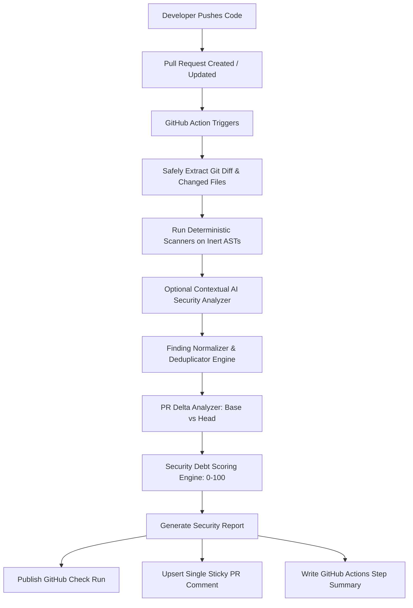

# AIShield GitHub Actions Integration

## 1. Overview & Architecture

AIShield integrates natively into GitHub Pull Request workflows through GitHub Actions. Whenever a pull request is opened, synchronized (new commits pushed), or reopened, AIShield inspects the pull request delta, computes deterministic security debt, posts a GitHub Check Run, and maintains a single "sticky" comment on the PR conversation thread.



---

## 2. Security Boundaries & Invariants

### 2.1 Zero Automatic Merges (Strict Invariant)
AIShield functions strictly as an **informational security debt advisor**.
- AIShield **never** automatically merges pull requests.
- AIShield **never** approves pull requests or bypasses branch protection rules.
- The repository maintainer and peer developers retain full ownership and discretion over review and merge decisions.

### 2.2 Untrusted PR Code Isolation (Fork Safety)
Pull requests—especially from public forks—contain untrusted, unreviewed code. AIShield enforces strict code execution safeguards:
- **No Repository Code Execution:** AIShield scanners (Semgrep, Gitleaks, OSV/Dependency Scanner) treat repository files strictly as inert text and AST data.
- **No Package Install or Build Scripts:** AIShield does not run `npm install`, `node`, `make`, `python`, or arbitrary shell scripts from the PR branch. Dependency analysis inspects manifest and lockfile JSON structures statically.
- **Sandboxed Execution:** Scanner adapters can run in read-only scratch workspaces or isolated Docker containers with non-root privileges and strict timeouts.

### 2.3 Least-Privilege Permissions
The GitHub Actions workflow requires only minimal, least-privilege permissions:

```yaml
permissions:
  contents: read          # Read access to clone and inspect repository files
  pull-requests: write    # Write access to post and update the single PR comment
  checks: write           # Write access to publish status checks and annotations
```

Forbidden permissions:
- `contents: write` (Not permitted—AIShield does not commit or alter branch history)
- `administration: write` (Not permitted)
- `actions: write` (Not permitted)

### 2.4 Handling Forked Pull Requests Gracefully
When a workflow runs against an untrusted public fork (`pull_request` event):
1. GitHub provides a **read-only** `GITHUB_TOKEN` and withholds repository secrets (e.g. `GEMINI_API_KEY`, custom tokens).
2. If GitHub denies comment creation or Check Run creation (`HTTP 403 Forbidden` / `Resource not accessible by integration`), AIShield:
   - Does **not** crash or fail the workflow run.
   - Logs an informational warning in the action log.
   - Writes the complete, formatted report directly to `GITHUB_STEP_SUMMARY`, making the analysis visible in the GitHub Actions run summary tab for maintainers.

### 2.5 Secret Masking & Defense-in-Depth Redaction
1. **GitHub Token Masking:** The `GITHUB_TOKEN` is automatically registered with `::add-mask::` on GitHub Actions runners, preventing accidental log leakage.
2. **Finding Redaction:** Before any comment or check annotation is generated, all finding titles, descriptions, code snippets, and file paths are processed through `redactSensitivePatterns`.
3. **No Plain Secrets:** Raw credentials detected by Gitleaks or Semgrep are always masked (e.g., `AKIA************MPLE` or `[REDACTED]`) and fingerprint-hashed with SHA-256.

---

## 3. Pull Request Comment Structure

To avoid spamming PR conversation threads on every commit push, AIShield uses a **sticky comment** pattern:
- The comment begins with a hidden HTML anchor: `<!-- aishield-security-report -->`.
- When new commits are pushed, AIShield queries the issue comments API, finds the existing comment by marker, and updates it in place via `PATCH`.
- If no existing comment is found, it creates the initial comment via `POST`.

### Comment Format Specification
The PR comment strictly follows this concise layout:

```markdown
<!-- aishield-security-report -->
## AIShield Security Report

### Overall Security Debt:
32/100

### Previous:
20/100

### Change:
+12

### Risk:
MEDIUM

| Metric | Value |
| :--- | :--- |
| **Overall Security Debt** | **32/100** |
| **Previous** | 20/100 |
| **Change** | `+12` |
| **Risk** | **🟡 MEDIUM** |
| **New Debt Introduced** | +12 |
| **Debt Resolved** | -0 |

### New Findings: (1)
- 🟠 HIGH **SQL Injection in query builder** (`sql-injection`)
  - **Location:** `src/db/query.ts:42` | **Category:** `injection` | **CWE:** CWE-89
  - **Remediation:** Use parameterized queries or ORM query builder methods.

### Resolved Findings: (1)
- 🟢 ~~[CRITICAL] **Exposed API Token**~~ in `config/api.ts:8` *(Resolved)*

### Top Security Risks:
1. 🟠 HIGH **SQL Injection in query builder** in `src/db/query.ts:42` (Debt Points: 18.5)
   - *Impact:* Unsanitized user input concatenated to SQL statement

### Suggested Actions:
1. **Parameterize Dynamic Inputs:** Injection vulnerabilities were detected. Replace dynamic string concatenation in queries with parameterized APIs.
2. **Remediate New Debt:** This PR introduces **+12** new security debt. Resolve the flagged items before merging to prevent increasing default branch debt.

---
🔗 **[Link to full dashboard](https://aishield.dev/owner/repo/pull/42)**

> ℹ️ *AIShield is an informational security advisor. AIShield never automatically merges or approves pull requests.*
```

---

## 4. GitHub Check Run & In-Line Annotations

AIShield publishes a check run named `AIShield Security Debt` using the GitHub Checks API:

| Condition | Conclusion | Description |
| :--- | :--- | :--- |
| `riskLevel === 'CRITICAL'` or new `CRITICAL` finding introduced | `failure` | Pull request introduces severe, high-risk security debt |
| `riskLevel === 'HIGH'` or new `HIGH` finding introduced | `neutral` (default) / `failure` (if `failOnHigh=true`) | Warns developers of elevated security debt |
| `riskLevel === 'MEDIUM'` or `'LOW'` and no critical/high issues | `success` | Security posture is within acceptable thresholds |

### Annotations:
Each newly introduced finding generates an in-line GitHub Check Annotation:
- **File & Line:** Exact location in the pull request diff
- **Level:** `failure` (CRITICAL/HIGH), `warning` (MEDIUM), `notice` (LOW/INFO)
- **Title & Message:** Rule ID, category, CWE, description, and suggested remediation

---

## 5. Workflow Configuration

Add the following file to your repository at `.github/workflows/aishield-pr-analysis.yml`:

```yaml
name: AIShield Security Debt Analysis

on:
  pull_request:
    types: [opened, synchronize, reopened]
    branches:
      - '**'

permissions:
  contents: read
  pull-requests: write
  checks: write

concurrency:
  group: aishield-${{ github.workflow }}-${{ github.event.pull_request.number || github.ref }}
  cancel-in-progress: true

jobs:
  analyze:
    name: Security Debt Scan & PR Delta
    runs-on: ubuntu-latest
    steps:
      - name: Checkout HEAD commit
        uses: actions/checkout@v4
        with:
          fetch-depth: 0
          ref: ${{ github.event.pull_request.head.sha }}

      - name: Fetch base branch
        run: |
          git fetch origin ${{ github.event.pull_request.base.ref }}:refs/remotes/origin/${{ github.event.pull_request.base.ref }}
        continue-on-error: true

      - name: Setup Node.js
        uses: actions/setup-node@v4
        with:
          node-version: '20'
          cache: 'npm'

      - name: Install dependencies
        run: npm ci

      - name: Build AIShield packages
        run: |
          npm run build:shared
          npm run build --workspace @aishield/worker

      - name: Run AIShield PR Security Analysis
        env:
          GITHUB_TOKEN: ${{ secrets.GITHUB_TOKEN }}
          GITHUB_EVENT_PATH: ${{ github.event_path }}
          GITHUB_REPOSITORY: ${{ github.repository }}
          FAIL_ON_CRITICAL: 'false'
          DASHBOARD_URL: 'https://aishield.dev/${{ github.repository }}/pull/${{ github.event.pull_request.number }}'
        run: |
          node apps/worker/dist/github/run-pr-analysis.js
```
