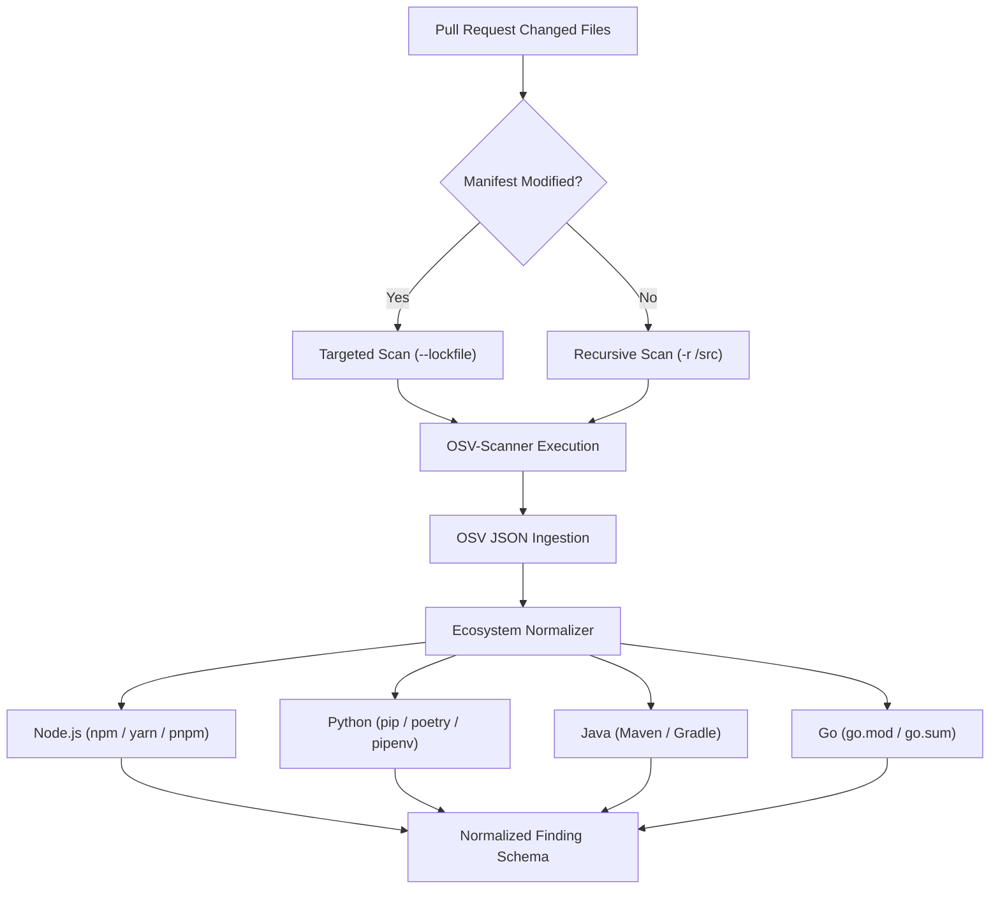

# Dependency Vulnerability Analysis Architecture

## 1. Overview & Role in AIShield Debt

Modern applications inherit up to 90% of their codebase from open-source dependencies. AI-assisted code generation frequently suggests outdated packages or vulnerable versions that introduce severe security debt (e.g. Prototype Pollution, Remote Code Execution, Path Traversal).

AIShield Debt incorporates **Software Composition Analysis (SCA)** using **OSV-Scanner** (developed by Google and the Open Source Security Foundation - OpenSSF):

- **No Custom Vulnerability Database**: Rather than attempting to maintain a proprietary, duplicate vulnerability database, AIShield delegates vulnerability detection to the distributed **OSV.dev** database, which aggregates:
  - GitHub Advisory Database (GHSA)
  - National Vulnerability Database (NVD / CVE)
  - PyPA Advisory Database (Python)
  - RustSec Advisory Database (Rust)
  - Go Vulnerability Database (Go)
  - Global Security Database (GSD)
- **Unified Normalization**: Findings are normalized into AIShield's standard `NormalizedFinding` schema, assigning severity, CWE mappings, remediation guidance, and stable fingerprints for debt scoring.

---

## 2. Multi-Ecosystem Architecture & Extensibility

The `DependencyScanner` is engineered around an extensible registry of package ecosystems:

### Supported Manifests by Ecosystem
| Ecosystem | Primary Lockfiles & Manifests | Extracted Advisory IDs |
| --- | --- | --- |
| **Node.js** (`npm`) | `package-lock.json`, `yarn.lock`, `pnpm-lock.yaml`, `package.json` | GHSA, CVE, CWE |
| **Python** (`PyPI`) | `requirements.txt`, `poetry.lock`, `Pipfile.lock`, `setup.py` | GHSA, CVE, PYSEC |
| **Java** (`Maven`) | `pom.xml`, `build.gradle`, `build.gradle.kts`, `gradle.lockfile` | GHSA, CVE, CWE |
| **Go** (`Go`) | `go.sum`, `go.mod` | GHSA, CVE, GO |
| **Rust** (`crates.io`) | `Cargo.lock` | GHSA, CVE, RUSTSEC |
| **.NET** (`NuGet`) | `packages.lock.json` | GHSA, CVE |

New ecosystems are registered simply by adding their lockfile definitions to `SUPPORTED_ECOSYSTEMS`.

---

## 3. Vulnerability Normalization & Advisory Mapping

### ID Extraction & Cross-Referencing
OSV advisories report a primary identifier and an array of aliases. AIShield automatically correlates these identifiers:
- **GHSA Identification**: Matched via `/^GHSA-[a-z0-9]{4}-[a-z0-9]{4}-[a-z0-9]{4}$/i`.
- **CVE Identification**: Matched via `/^CVE-\d{4}-\d+$/i`.
- **Standardized `ruleId`**: Preferentially selects the GHSA or CVE ID, ensuring human-readable, searchable findings in reports and dashboards. Both IDs and all aliases are retained in `metadata`.

### Severity Ladder Mapping
Severity is computed across three fallback mechanisms:
1. **Advisory Database Severity**: Direct mapping of `database_specific.severity` (`CRITICAL` $\rightarrow$ `critical`, `HIGH` $\rightarrow$ `high`, `MODERATE`/`MEDIUM` $\rightarrow$ `medium`, `LOW` $\rightarrow$ `low`).
2. **CVSS v3 Vectors & Scores**: Parses CVSS base metrics; scores $\ge 9.0$ map to `critical`, $7.0-8.9$ to `high`, $4.0-6.9$ to `medium`.
3. **CWE Impact Escalation**: Critical RCE/Deserialization CWEs (`CWE-502`, `CWE-78`, `CWE-89`, `CWE-95`) default to `critical`.

### Automated Remediation Guidance
The scanner parses `affected[].ranges[].events[].fixed` to pinpoint the minimum secure version:
- When fix version is known: `Upgrade <packageName> to version <fixedVersion> or higher.`
- When unpatched / zero-day: `Review advisory <ruleId> and update <packageName> to a patched release.`

---

## 4. Invariant Fingerprinting for Deduplication

To ensure that dependency findings remain durable across scans without duplicating debt records, fingerprints are computed cryptographically:

$$\text{Fingerprint} = \text{SHA-256}(\text{"dependency:"} + \text{ManifestPath} + \text{":"} + \text{Ecosystem} + \text{":"} + \text{Package} + \text{"@"} + \text{Version} + \text{":"} + \text{RuleID})$$

- **Invariant Across Formatting**: Whitespace changes in `package-lock.json` do not alter the fingerprint.
- **Automatic Debt Resolution**: Once a developer upgrades the dependency to the fixed version, the installed version token in the fingerprint changes, cleanly marking the old vulnerability as resolved in the debt engine.

---

## 5. Pull Request Delta Optimization

To maintain sub-minute PR check times:
1. **Lockfile Change Detection**: If a PR contains changes to `package-lock.json` or other manifests, the scanner passes `--lockfile=<file>` directly.
2. **Skip When Untouched**: If a PR only alters non-manifest files (e.g. `src/utils.ts`), findings are filtered to PR-affected manifests, preventing unrelated codebase dependency debt from failing incremental PR checks.

---

## 6. Docker Sandboxing

When running in container mode (`SCANNER_RUNNER=docker`):
- **Image**: `ghcr.io/google/osv-scanner:v1.7.0`
- **Read-Only Code Mount**: `-v ${targetPath}:/src:ro` (no write access to scanned code)
- **Container Isolation**: `--cap-drop=ALL --security-opt=no-new-privileges`
- **Network Access**: OSV requires outbound HTTPS (`--network bridge`) to query `api.osv.dev` for up-to-date vulnerability hashes.
- **Path Sanitization**: `/src/` volume prefixes are automatically stripped from emitted file paths.
